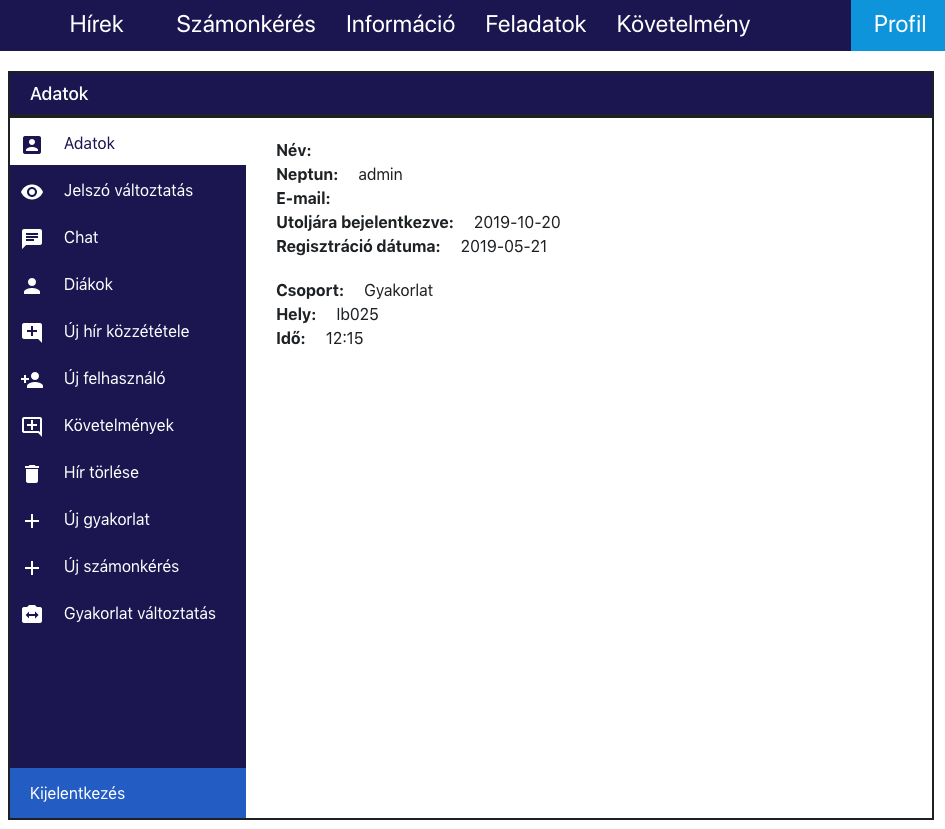
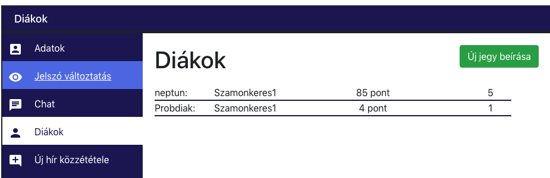
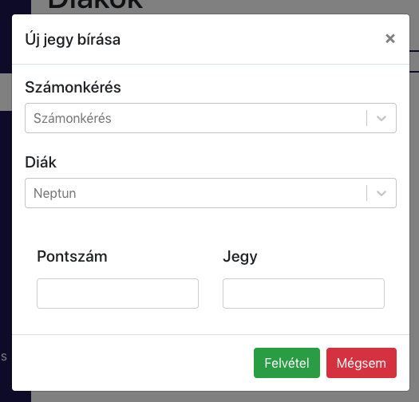
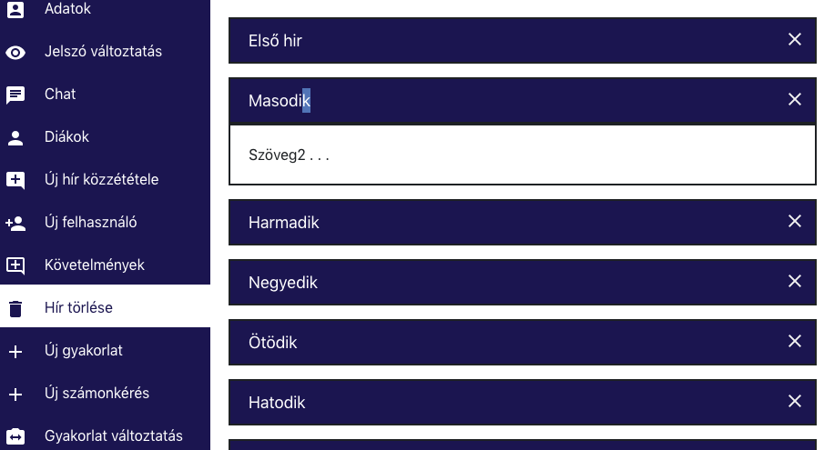
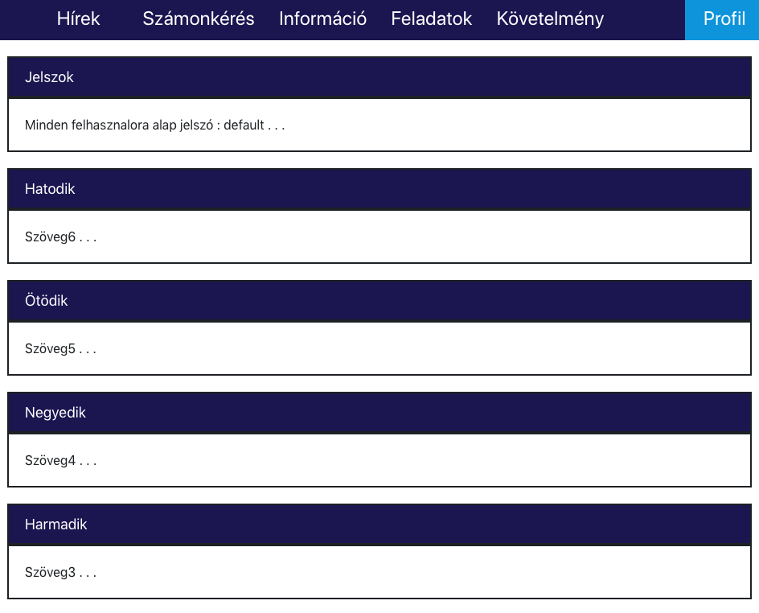
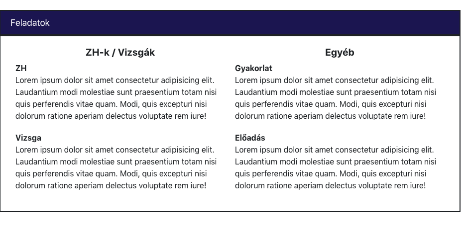
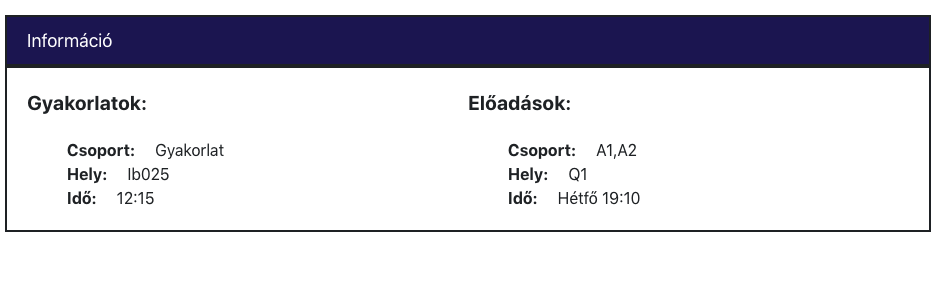

# Analízis Önlab
Team Project for BME Onlab with [@gszasza1](https://github.com/gszasza1)
Made with MongoDb, React and Spring Boot.

## Screenshots

Analízis tantárgyhoz oldal készítés
## Travis 

## Codacy 

## [Docker Hub](https://hub.docker.com/r/martinhuszti/analisebme)

## [Heroku App](https://analisebme.herokuapp.com)

## [Dokumentáció](https://docs.google.com/document/d/1BKCGCjtadtMlMPi3LDQtWv-zOd3Gi5u4vg0AmCtRTl4/edit?usp=sharing)

## [Prezentáció](https://drive.google.com/open?id=1QcHG_ATt6uok3RhHdi9irTuNtb4oRjkvrATwSSylv4M)
